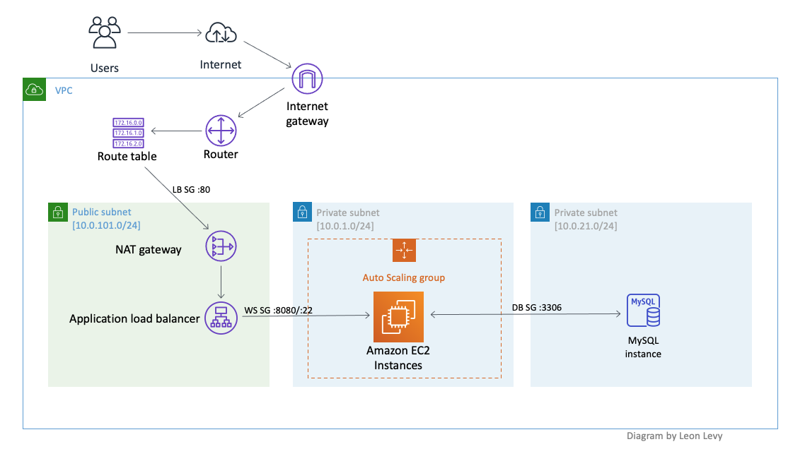

# demo-tform-n-tier



Structure:

```
    .
    ├── LICENSE
    ├── README.md
    ├── main.tf
    ├── modules
    │   ├── autoscaling
    │   │   ├── cloud_config.yaml
    │   │   ├── main.tf
    │   │   ├── outputs.tf
    │   │   └── variables.tf
    │   ├── database
    │   │   ├── main.tf
    │   │   ├── outputs.tf
    │   │   └── variables.tf
    │   └── networking
    │       ├── main.tf
    │       ├── outputs.tf
    │       └── variables.tf
    ├── outputs.tf
    ├── providers.tf
    ├── terraform.tfvars
    ├── variables.tf
    └── versions.tf
```

Outputs:

    db_password = <password of MySQL database>
    lb_dns_name = <url of website>


Source code for web application:
     https://github.com/scottwinkler/vanilla-webserver-src